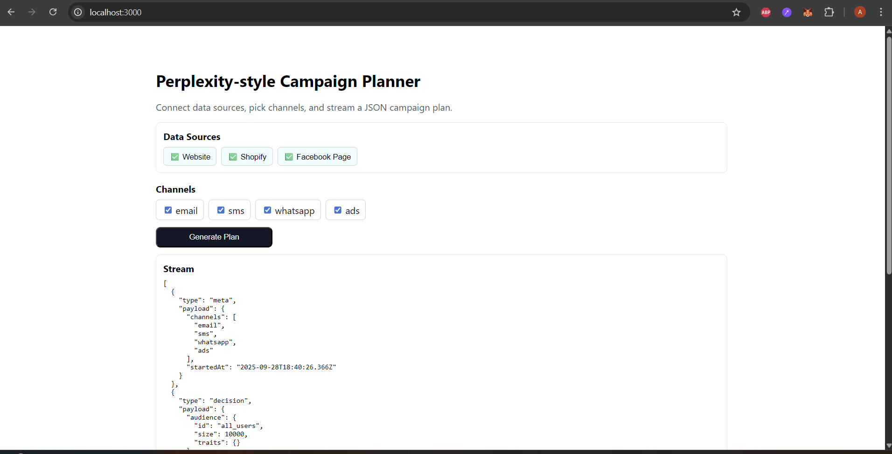

Markopolo AI – Full-Stack Challenge

A Next.js + TypeScript app that simulates a Perplexity-style planner.
It connects to three mocked data sources (Website, Shopify, Facebook Page) and outputs a streaming JSON campaign plan across four channels (Email, SMS, WhatsApp, Ads).

Getting Started: git clone the project and then 
npm install ,
npm run dev

Then open http://localhost:3000  

Tips : Click to select all Data Sources and Channels then click Generate Plan button

##  Preview:

Tech Stack:

Next.js 14 (App Router)

TypeScript

Server-Sent Events (SSE) for real-time streaming

Where to Look:

/app/api/connect/route.ts – connect a data source

/app/api/stream/route.ts – stream JSON plan (SSE)

/lib/engine.ts – decision logic and audience plan generation

/lib/connectors.ts – mock data sources (with commented examples for real APIs)

/components/ConnectorPicker.tsx – data source connection UI

/components/Chat.tsx – channel selector and streaming JSON viewer

Notes:

This repository uses mock connectors so it runs without any external credentials. That means you can clone and run it out-of-the-box — no API keys or accounts are required.

(Optional) Using Real Credentials:

If you want to connect real data sources (Shopify, Facebook, website events, etc.) instead of the mock data, you can do so easily:

Add credentials to a .env.local file (example):

# Shopify Admin API
SHOPIFY_SHOP_DOMAIN=your-shop-name.myshopify.com
SHOPIFY_ADMIN_TOKEN=shpat_xxxxxxxxxxxxxxx

# Facebook Graph API
FB_PAGE_ID=1234567890
FB_PAGE_ACCESS_TOKEN=EAABxxxxxxxxxxxx

# Website / Pixel event ingestion
EVENT_SIGNING_SECRET=my-secret-key

Uncomment the real API functions in lib/connectors.ts

They show how to fetch audiences from Shopify, Facebook, or website analytics.

Deploy with real data – the rest of the system (UI, streaming, JSON format) will work without modification.

For this challenge , don’t need real credentials — dummy data is sufficient. This section just demonstrates how the project is designed to scale to a production environment.